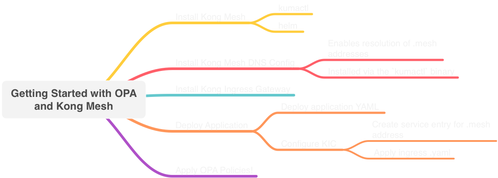

# Kong Mesh and Open Policy Agent (OPA) 

## Demo for 6/9 Webinar with Styra 

This repository contains the demo code for the initial demo webinar for Open Policy Agent and Kong Mesh

The webinar details can be found here - https://konghq.com/webinars/kong-mesh-open-policy-agent



## Repeatable Flow 

This assumes you have installed the Helm repository for Kong Mesh as well as have the Kmactl binaries installed locally on your system. This repo also contains a basic Insomnia collection for the demo application that you can use to replicate the API calls against the application if you wish.

Insomnia Note: If you choose to use Insomnia to create API calls, ensure you have created an `Environment` with the necessary configurations. A sample of this from my environment is below. 

```json
{
  "base_url": "kongingress.yourenv.com",
  "jwtToken": "Response -> Body Attribute"
}
```

* Clone down this repository locally 
* Create the Kong Mesh namespace in your Kubernetes cluster 
```bash
kubectl create ns kong-mesh-system
```
* Install Kong Mesh (OPA integration is a Kong Mesh feature) 
```bash 
helm upgrade -i -n kong-mesh-system kong-mesh kong-mesh/kong-mesh
```
* Install the Kong Ingress controller via the Kumactl command 
```bash
kumactl install gateway kong | kubectl apply -f -
```
* Deploy the application manifest (`1-single-site.yaml`) via 
```bash
kubectl apply -f 1-single-site.yaml
```
This deploys the app and configures the Kong ingress controller for connectivity to the app. Depending on your cloud vendor - the connectivity to the service may take a few moments to register with DNS and connect successfully
* Observe application functioning normally by connecting to the KIC service - 
```bash
kubectl get svc -n kuma-gateway
``` 
* Apply the OPA policy manifest with the allow statements commented out
```bash
kubectl apply -f 2-opa-auth-kube.yaml
```
* Observe the application is now failing connectivity between all tiers. This is because of the default deny for all application traffic. 
* Progressively step through enabling aspects of the traffic based on what you would like to display and reapply the manifest. There is a sample flow kept within the `2-opa-kube-auth.yaml` file that you can follow to progressively enable aspects of the application. 
